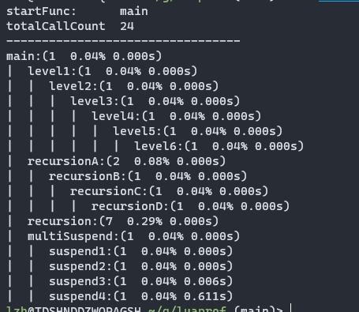
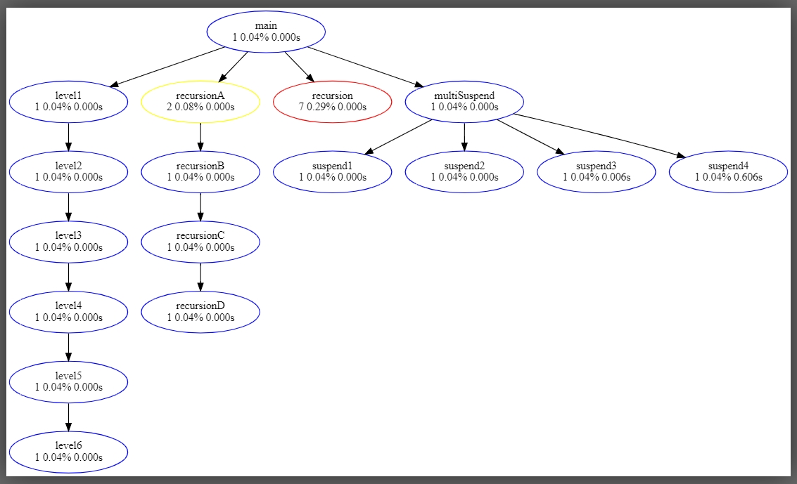
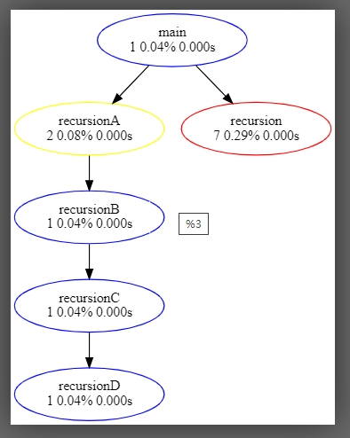

# luaprof

## 说明
Lua 性能检测工具

**功能**
- 检测每个函数的实际执行时间
- 检测每个函数的执行次数
- 到函数调用关系导出为图像

## 效果图

**终端打印图**
括号中第一列为函数调用次数，第二列为函数调用占总函数调用的比例，第三列为函数总的实际执行时间

**graphviz调用关系导出图(未开启剪枝)**

**graphviz调用关系导出图(开启剪枝，不显示所有调用次数少于2的函数节点)**

## 参考
> [利用debug库实现对lua的性能分析](https://tboox.org/cn/2017/01/12/lua-profiler/)
