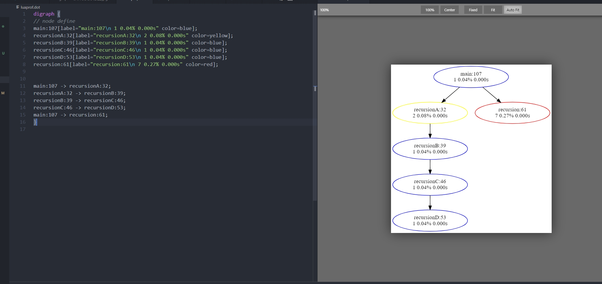

# luaprof

## 说明
Lua 性能检测工具

**功能**
- 检测每个函数的实际执行时间
- 检测每个函数的执行次数
- 到函数调用关系导出为图像


## 效果图

**终端打印图**

括号中第一列为函数调用次数，第二列为函数调用占总函数调用的比例，第三列为函数总的实际执行时间


**graphviz调用关系导出图(未开启剪枝)**


**graphviz调用关系导出图(开启剪枝，不显示所有调用次数少于2的函数节点，注意：当前设计方案对于递归调用无法消除)**


## 安装
要使用这个库，需要将 `timer.c` 编译成动态库，`timer.c` 需要用到 Lua 的头文件，如果系统中没有的话，需要手动安装

在 Ubuntu 系统中，安装方式为
```
sudo apt-get install lua5.3-dev
```

安装完头文件后，执行 `sh build.sh` 即可编译出 `timerlib.so` 动态库

为了将 `*.dot` 文件转化为图像，需要安装 graphviz

在 Ununtu 中安装方式为
```
sudo aot-get install graphviz
```
在windows 下需要下载 graphviz 自己手动安装，安装后之后将安装路径添加到系统路径
[graphviz下载地址](https://www2.graphviz.org/Packages/stable/windows/)


为了能方便的使用 graphviz，可以安装 vscode 插件 Graphviz Preview(作者:EFanZh)。安装完插件后，打开 `.dot` 后缀文件就可以方便地预览和导出图像了。使用示意图




## 参考
> [利用debug库实现对lua的性能分析](https://tboox.org/cn/2017/01/12/lua-profiler/)
